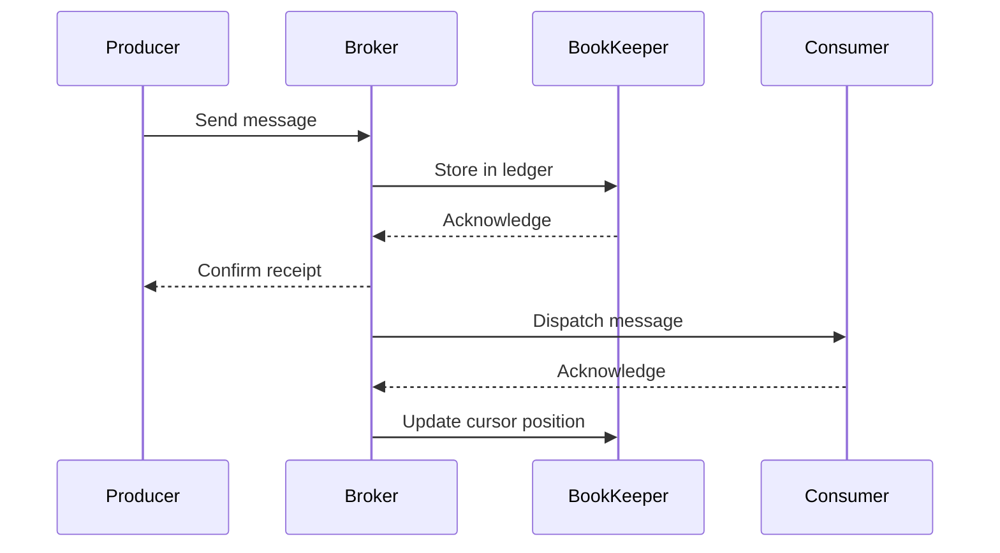

Apache Pulsar is a distributed pub-sub messaging platform with a unique architecture that separates message serving from message storage. This design provides scalability, durability, and performance.

## Layered Architecture

Pulsar's architecture consists of multiple layers that work together to provide a complete messaging system:

<CardGroup cols={2}>
  <Card title="Broker Layer" icon="server">
    Stateless serving layer that handles message routing and client connections
  </Card>
  <Card title="Storage Layer" icon="database">
    Persistent storage using Apache BookKeeper for durable message storage
  </Card>
  <Card title="Metadata Layer" icon="diagram-project">
    Coordination and metadata storage using ZooKeeper or other metadata stores
  </Card>
  <Card title="Client Layer" icon="users">
    Producer and consumer clients that interact with brokers
  </Card>
</CardGroup>

## Core Components

### Brokers

Brokers are stateless service nodes that handle message routing and client connections. From the source code at `pulsar-broker/src/main/java/org/apache/pulsar/broker/service/BrokerService.java`, brokers provide:

- Client connection handling (binary protocol on port 6650 by default)
- HTTP/REST API (port 8080 by default)
- Topic ownership management
- Message routing between producers and consumers
- Load balancing across the cluster

<Info>
Brokers are stateless, which means they can be added or removed from the cluster dynamically without data migration. All persistent state is stored in BookKeeper.
</Info>

```java
// From pulsar-broker/src/main/java/org/apache/pulsar/broker
// Brokers use the PulsarService class as the main entry point
public class PulsarService implements AutoCloseable {
    private BrokerService brokerService;
    private MetadataStoreExtended localMetadataStore;
    // Stateless broker logic
}
```

### Apache BookKeeper (Storage Layer)

BookKeeper provides the persistent storage layer through a system of ledgers. The managed ledger abstraction (from `managed-ledger/src/main/java/org/apache/bookkeeper/mledger/ManagedLedger.java`) sits on top of BookKeeper:

- **Ledgers**: Immutable, append-only log segments
- **Managed Ledgers**: Named log streams that automatically manage multiple BookKeeper ledgers
- **Cursors**: Track consumer positions within managed ledgers

```java
// From managed-ledger/src/main/java/org/apache/bookkeeper/mledger/ManagedLedger.java
public interface ManagedLedger {
    /**
     * A ManagedLedger is a superset of a BookKeeper ledger concept.
     * - has a unique name (chosen by clients)
     * - is always writable: if a writer crashes, a new writer can continue
     * - has multiple persisted consumers (ManagedCursor)
     * - when all consumers process entries in a ledger, the ledger is deleted
     */
    Position addEntry(byte[] data) throws InterruptedException, ManagedLedgerException;
    ManagedCursor openCursor(String name) throws InterruptedException, ManagedLedgerException;
}
```

<Info>
ManagedLedger automatically handles ledger rollover, garbage collection, and cursor management. Each Pulsar topic is backed by exactly one ManagedLedger.
</Info>

### Metadata Store

The metadata store coordinates the cluster and stores configuration. From `conf/broker.conf`, Pulsar supports:

- **ZooKeeper**: Traditional coordination service
- **etcd**: Alternative metadata store
- **RocksDB**: Embedded metadata store for single-node deployments

Metadata stored includes:
- Topic ownership assignments
- Namespace configurations
- Schema registry
- Cluster coordination
- Tenant and namespace metadata

## Separation of Concerns

Pulsar's architecture separates three critical concerns:

<Steps>
  <Step title="Serving (Brokers)">
    Stateless brokers handle protocol, routing, and client connections. They can scale independently based on connection count and throughput.
  </Step>
  <Step title="Storage (BookKeeper)">
    BookKeeper bookies store messages durably. Storage can scale independently based on data retention requirements.
  </Step>
  <Step title="Coordination (Metadata Store)">
    Metadata store manages cluster state and configuration without handling message data.
  </Step>
</Steps>

This separation provides:

- **Independent scaling**: Scale serving and storage independently
- **Fast failover**: Brokers are stateless, so failover is instant
- **No data rebalancing**: Adding/removing brokers doesn't require data movement
- **Operational flexibility**: Upgrade components independently

## Message Flow

Here's how messages flow through the system:



## High Availability

Pulsar achieves high availability through:

1. **Broker redundancy**: Multiple brokers share topic ownership
2. **BookKeeper quorum**: Configurable replication (typically 3 copies)
3. **Metadata store quorum**: ZooKeeper/etcd ensemble (3 or 5 nodes)
4. **Automatic failover**: Topic ownership transfers automatically on broker failure

<Warning>
For production deployments, always run at least 3 brokers, 3 bookies, and 3 metadata store nodes to ensure high availability.
</Warning>

## Configuration

Key broker configuration parameters from `conf/broker.conf`:

```properties
# Metadata store connection
metadataStoreUrl=zk:localhost:2181

# Service ports
brokerServicePort=6650
webServicePort=8080

# Advertised address for clients
advertisedAddress=broker.example.com
```

## Next Steps

<CardGroup cols={2}>
  <Card title="Messaging Model" icon="message" href="/concepts/messaging">
    Learn about Pulsar's messaging semantics
  </Card>
  <Card title="Topics" icon="layer-group" href="/concepts/topics">
    Understand how topics organize messages
  </Card>
  <Card title="Multi-Tenancy" icon="building" href="/concepts/multi-tenancy">
    Explore Pulsar's tenant isolation features
  </Card>
  <Card title="Subscriptions" icon="rss" href="/concepts/subscriptions">
    Deep dive into subscription types
  </Card>
</CardGroup>